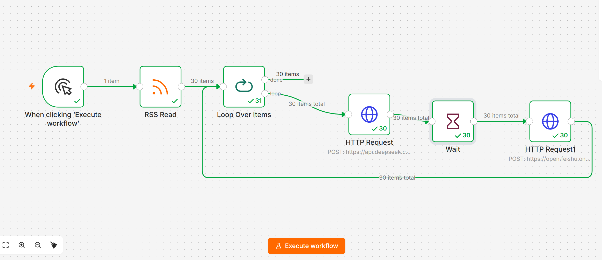
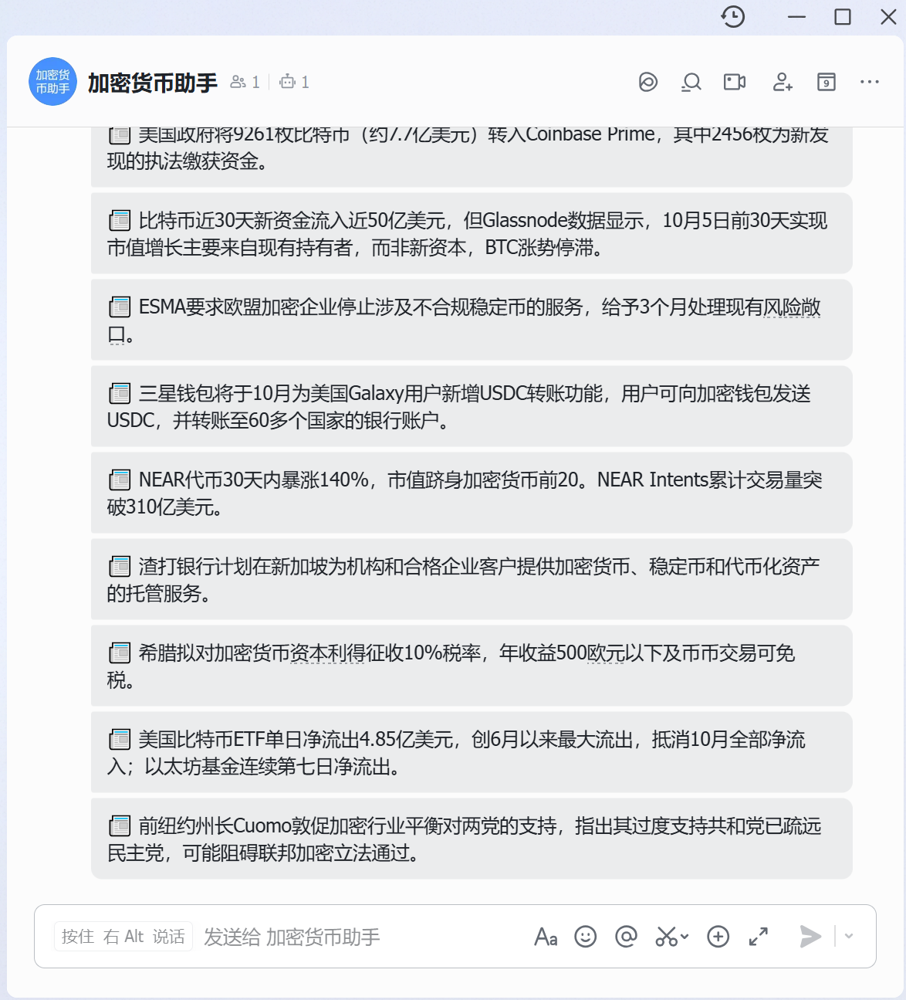

# 加密新闻 AI 自动摘要工作流

用 n8n + DeepSeek API 搭建的 AI Agent 工作流，每天定时抓取加密新闻，
自动生成中文摘要并推送到飞书群。

## 工作流结构

RSS Read → Loop Over Items → DeepSeek API → Wait (5s) → 飞书推送

## 技术栈

- **n8n** — 工作流自动化平台
- **DeepSeek API** — 大模型摘要生成
- **飞书 Webhook** — 消息推送
- **Cointelegraph RSS** — 新闻数据源

## 遇到的关键问题

1. **表达式未解析**：JSON Body 需要切换到表达式模式，才能让 `{{ $json.title }}` 生效
2. **飞书限流**：短时间内推送太多消息会触发限流，加入 Wait 节点做 2 秒延迟解决
3. **循环闭环**：Loop Over Items 需要把结果连回输入端才能持续循环

## 成果

- 每天自动处理 30 条新闻
- 每条新闻生成 80 字以内中文摘要
- 全程零代码，人工只需几分钟复核

